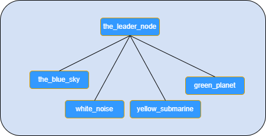
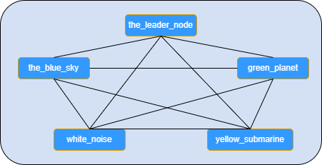

# 許可型分散ブロックチェーンの実装

許可型分散ブロックチェーンで各ノードが、ドローンの離着陸地点の予約を管理してるポイントだとした時、ドローンの着陸離陸許可がされる様子をデモする

### 許可型分散ブロックチェーンのエンティティ

<center>
  <table border="2">
     <tr>
      <td>ノード</td>
    </tr> 
    <tr>
      <td>ブロック</td>
    </tr>
    <tr>
      <td>ブロックチェーン</td>
    </tr>
    <tr>
      <td>ネットワーク</td>
    </tr>     
    <tr>
      <td>ウォレット</td>
    </tr>    
    <tr>
      <td>トランザクション</td>
    </tr>     
    <tr>
      <td>スマートコントラクト</td>
    </tr>           
 </table>
</center>

### 許可型分散ブロックチェーンにおいて論理的な単一性を実現します

分散されたノードに生成される複数のブロックチェーンの間でどのように同期を取るかという問題です

   1. 許可型を前提している
        - そのため、参加するノードを特定のネットワーク構造に組み込む事が可能となる     
   2. 分散ブロックチェーンの中で常に特定の１つのブロックチェーンが最長であるようにする
        - ネットワーク形状の指定（１つのリーダーノードを持つ、スター型の分散ネットワーク）
        - その結果として、ブロックが生成された際にはリーダーのみにブロードキャストを行う事となる
        - それは、リーダーノードが常に他よりも長いチェーンを生成する事を可能にする
   3. 複数存在するチェーンを常に最も長いものに同期する
        - 結果、リーダーノードが持つチェーンが常に論理的に単一なチェーンとして選択されます


以上をデモを持って確認する


```python
from __future__ import annotations
from dataclasses import dataclass
```


```python
from Crypto.Signature import PKCS1_v1_5
from Crypto.Hash import SHA
from Crypto.PublicKey import RSA
import binascii

import json
import dataclasses as dc
from typing import List

import multiprocessing as mp
import random
from itertools import count
from time import sleep

from typing import Tuple, Sequence
import hashlib

from time import time
```


```python
import sys
sys.path.append('src/')
```


```python
from node import Node
from block import Block
from blockchain import BlockChain
from network import Network
from wallet import Wallet
from smartcontract import Smartcontract
```

## ノード1つの場合のデモ


```python
genesis=Block(time(), (), "0")
uuid='the_leader_node'
network=Network({uuid:[uuid]})
node=Node(network, genesis, uuid)
```


```python
if False:
    node.work(verbose=False)
```


```python
network.shutdown()
```

# 許可型分散ブロックチェーンのデモ


```python
genesis=Block(time(), (), "genesis")
network=Network()
```

- ノードを生成する
    - ノードにはデモで分かりやすいように名前を与えてある


```python
nodes=['the_leader_node', 'the_blue_sky', 'white_noise', 'yellow_submarine', 'green_planet']

```

## ネットワークの形状を定義する
- ネットワークの形状として、序列を持つ結合を選択する事が私たちの目的遂行のために重要です
    1. リーダーノードにおけるチェーンは常に全ノードにおける新たなブロックの生成を取り込みます
      - そのためリーダーノードのチェーンは常に最も長いチェーンの１つとなります
    2- 全てのノードが最も長いチェーンに基づいてアップデートされます

- 比較のために、以下に全結合の場合のネットワークの形状示します
    - リーダーノードは他のノードと結合しているが、その他のノードはリーダーとのみ結合しています
    - 序列を持つ結合もそれぞれのノードは対等なノードで、現在の実装では結合の仕方が異なるのみです
    - 他方で、全結合の場合は全てのノード同士が結合しています


<table>
<tr>
    <td>
序列を持つ結合
<div>

</div>
    </td>
    <td>
全結合        
<div>

</div>
    </td>
  </tr>
</table>
    


```python
ORDERING=True
if (ORDERING):
    network.neighbours['the_leader_node']=['the_leader_node', 'the_blue_sky', 'white_noise', 'yellow_submarine', 'green_planet']
    network.neighbours['the_blue_sky']=['the_leader_node', 'the_blue_sky']
    network.neighbours['white_noise']=['the_leader_node', 'white_noise']
    network.neighbours['yellow_submarine']=['the_leader_node', 'yellow_submarine']
    network.neighbours['green_planet']=['the_leader_node', 'green_planet']
else:
    for uuid in nodes:
        network.neighbours[uuid]=nodes
```

- ノードを起動する


```python
def node_work(uuid):
    node=Node(network, genesis, uuid)
    node.work()
```


```python
workers=[]
for uuid in nodes:
    worker=mp.Process(target=node_work, args=(uuid,))
    workers.append(worker)
    worker.start()
```


```python
num_people=5
people=[Wallet(network, random.sample(nodes, random.randint(1, len(nodes)))) for _ in range(num_people)]
```

### ブロックチェーンの表示
- 各ノード上でブロックチェーンが生成される様子が見て取れる


```python
from IPython.display import clear_output
import time

timeout = time.time() + 60
def draw_chains(network):
    while True:
        if time.time() > timeout:
            break
        line=""
        for k, v in network.chains.items():
            line += f"(Node: {k[:15]}) "
            chain=BlockChain.json_loads(v)
            h=list(map(lambda x: x.hash()[:5], chain))
            line += "--".join(map(lambda x: f"[{x}]", h))
            line += "\n"
        print(line.rstrip())
        clear_output(True)
        sleep(1.0)

worker=mp.Process(target=draw_chains, args=(network,))
worker.start()
```


```python
def generate_transactions():
    for _ in range(random.randint(1,10)):
        sender, receiver= random.sample(people, 2)
        sender.send(receiver.address, 'a random transaction')
        receiver.send(sender.address, 'another random transaction')
```

    


ランダムにトランザクションを生成し、上でブロックチェーンが生成されている様子を確認する
- ブロックチェーンが生成されていれば、問題なく動作していると思われる
- 私たちの許可型分散ブロックチェーンにおいてはリーダーノードが他よりも一歩先んじて長くなる様子が観察される


```python
if False:
    generate_transactions()
```

### スマートコントラクトを実行します

- 以下のシナリオでデモを実行します
  1. the_leader_node が離着陸許可を取得する
  2. the_leader_node が離着陸許可をキャンセルする
  3. the_blue_sky が離着陸許可を取得する
  4. the_blue_sky が離着陸許可をキャンセルする 
- ブロックチェーンにおいて以上のトランザクションの履歴を確認します

ウォレットは予約の主体です

ウォレットが予約の行為を起こした時にトランザクションのインスタンスを生成します


```python
sc = Smartcontract(network)

s_uuid = 'the_leader_node'
s = Wallet(network, [s_uuid])
b_uuid = 'the_blue_sky'
b = Wallet(network, [b_uuid])
```


```python
sleep(1.0)
clear_output(True)

print(s_uuid + ' は離着陸地点を予約しました' if sc.make_a_reservation(s) else s_uuid + ' は離着陸地点は予約できませんでした')
```

    the_leader_node は離着陸地点を予約しました


```python
sleep(1.0)
clear_output(True)

print('\n以下ブロックチェーンの内容（トランザクションの履歴）')
for index, each in enumerate(sc.get_history_of_transactions_by_uuid(s_uuid)):
    print(str(index) +' '+ each)

print('\n以下ブロックチェーンの現在のステート')
print(sc.get_current_state(s_uuid))
```

    
    以下ブロックチェーンの内容（トランザクションの履歴）
    0 {"sender_address": ["the_leader_node"], "receiver_address": [null], "value": "reservation", "sign": null}
    
    以下ブロックチェーンの現在のステート
    {'sender_address': ['the_leader_node'], 'receiver_address': [None], 'reserved': 1}


```python
sleep(1.0)
clear_output(True)

print(s_uuid + ' により離着陸地点の予約はキャンセルされました' if sc.cancel_reservation(s) else s_uuid + ' によっては離着陸地点はキャンセルできませんでした')
```

    the_leader_node により離着陸地点の予約はキャンセルされました


```python
sleep(1.0)
clear_output(True)

print('\n以下ブロックチェーンの内容（トランザクションの履歴）')
for index, each in enumerate(sc.get_history_of_transactions_by_uuid(s_uuid)):
    print(str(index) +' '+ each)

print('\n以下ブロックチェーンの現在のステート')
print(sc.get_current_state(s_uuid))
```

    
    以下ブロックチェーンの内容（トランザクションの履歴）
    0 {"sender_address": ["the_leader_node"], "receiver_address": [null], "value": "reservation", "sign": null}
    1 {"sender_address": ["the_leader_node"], "receiver_address": [null], "value": "cancel", "sign": null}
    
    以下ブロックチェーンの現在のステート
    {'sender_address': None, 'receiver_address': None, 'reserved': 0}


```python
sleep(1.0)
clear_output(True)

print(b_uuid + ' は離着陸地点を予約しました' if sc.make_a_reservation(b) else b_uuid + ' は離着陸地点は予約できませんでした')
```

    the_blue_sky は離着陸地点を予約しました


```python
sleep(1.0)
clear_output(True)

print('\n以下ブロックチェーンの内容（トランザクションの履歴）')
for index, each in enumerate(sc.get_history_of_transactions_by_uuid(s_uuid)):
    print(str(index) +' '+ each)

print('\n以下ブロックチェーンの現在のステート')
print(sc.get_current_state(s_uuid))
```

    
    以下ブロックチェーンの内容（トランザクションの履歴）
    0 {"sender_address": ["the_leader_node"], "receiver_address": [null], "value": "reservation", "sign": null}
    1 {"sender_address": ["the_leader_node"], "receiver_address": [null], "value": "cancel", "sign": null}
    2 {"sender_address": ["the_blue_sky"], "receiver_address": [null], "value": "reservation", "sign": null}
    
    以下ブロックチェーンの現在のステート
    {'sender_address': ['the_blue_sky'], 'receiver_address': [None], 'reserved': 1}


```python
sleep(1.0)
clear_output(True)

print(b_uuid + ' により離着陸地点の予約はキャンセルされました' if sc.cancel_reservation(b) else b_uuid + ' によっては離着陸地点はキャンセルできませんでした')
```

    the_blue_sky により離着陸地点の予約はキャンセルされました


```python
clear_output(True)

print('\n以下ブロックチェーンの内容（トランザクションの履歴）')
for index, each in enumerate(sc.get_history_of_transactions_by_uuid(s_uuid)):
    print(str(index) +' '+ each)

print('\n以下ブロックチェーンの現在のステート')
print(sc.get_current_state(s_uuid))
```

    
    以下ブロックチェーンの内容（トランザクションの履歴）
    0 {"sender_address": ["the_leader_node"], "receiver_address": [null], "value": "reservation", "sign": null}
    1 {"sender_address": ["the_leader_node"], "receiver_address": [null], "value": "cancel", "sign": null}
    2 {"sender_address": ["the_blue_sky"], "receiver_address": [null], "value": "reservation", "sign": null}
    
    以下ブロックチェーンの現在のステート
    {'sender_address': ['the_blue_sky'], 'receiver_address': [None], 'reserved': 1}


```python
sleep(1.0)
clear_output(True)

print(b_uuid + ' により離着陸地点の予約はキャンセルされました' if sc.cancel_reservation(b) else b_uuid + ' によっては離着陸地点はキャンセルできませんでした')

print('\n以下ブロックチェーンの内容（トランザクションの履歴）')
for index, each in enumerate(sc.get_history_of_transactions_by_uuid(s_uuid)):
    print(str(index) +' '+ each)

print('\n以下ブロックチェーンの現在のステート')
print(sc.get_current_state(s_uuid))
```

    the_blue_sky によっては離着陸地点はキャンセルできませんでした
    
    以下ブロックチェーンの内容（トランザクションの履歴）
    0 {"sender_address": ["the_leader_node"], "receiver_address": [null], "value": "reservation", "sign": null}
    1 {"sender_address": ["the_leader_node"], "receiver_address": [null], "value": "cancel", "sign": null}
    2 {"sender_address": ["the_blue_sky"], "receiver_address": [null], "value": "reservation", "sign": null}
    3 {"sender_address": ["the_blue_sky"], "receiver_address": [null], "value": "cancel", "sign": null}
    
    以下ブロックチェーンの現在のステート
    {'sender_address': None, 'receiver_address': None, 'reserved': 0}


### 履歴の確認
- 許可型分散ブロックチェーンにおいて予測したとおりのトランザクションの履歴が確認できました


```python
worker.terminate()
worker.kill()
for worker in workers:
    worker.terminate()
    worker.kill()
network.shutdown()
```

### 参考文献
- [PythonでBlockchainの実装](https://github.com/tamuhey/python_blockchain)
    - ブロックチェーンの実装を参照しました

以上になります
